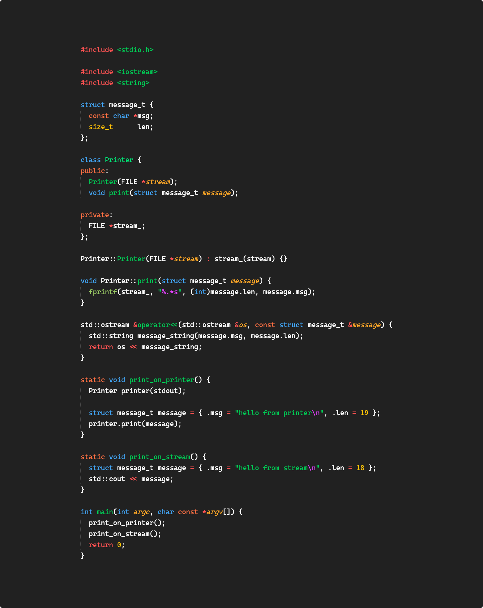
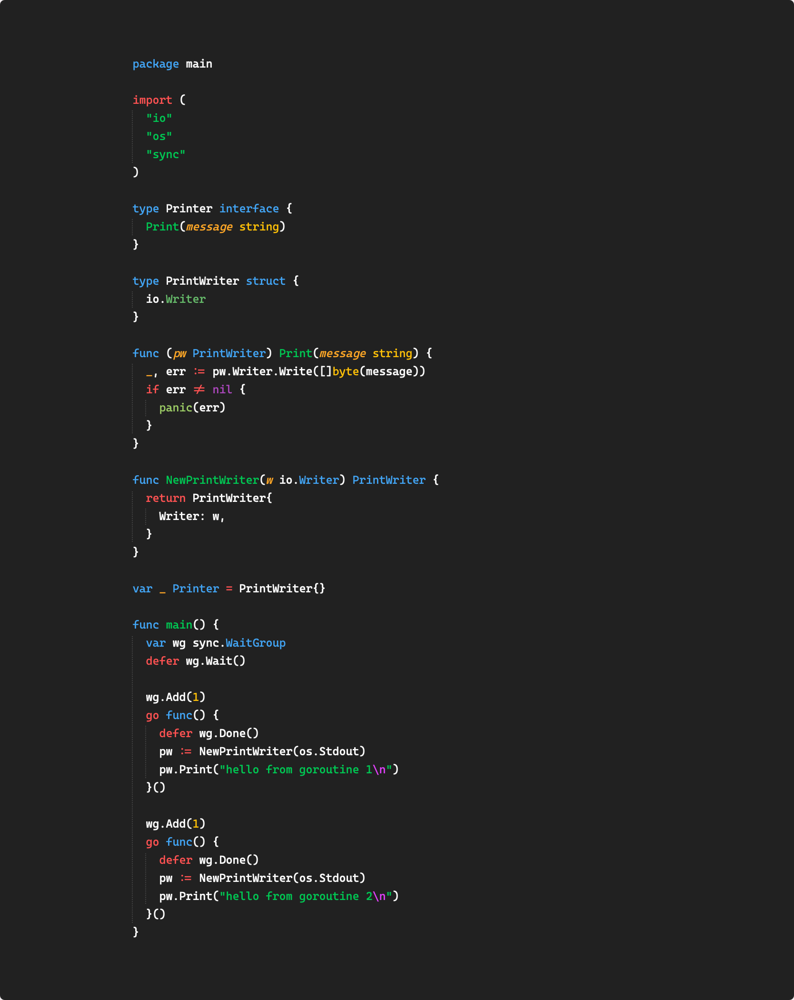
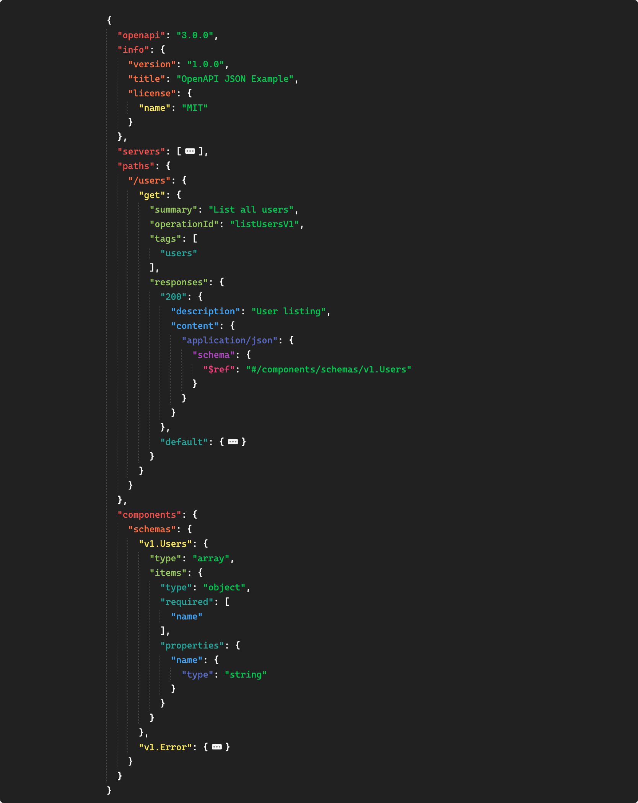
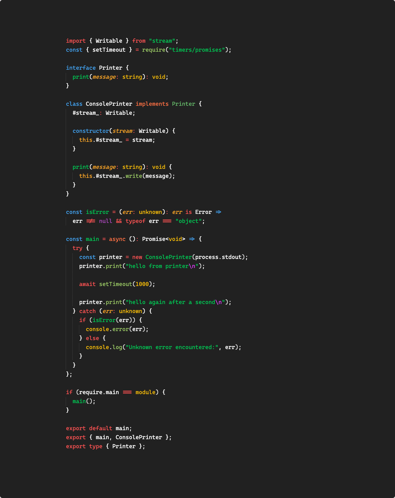
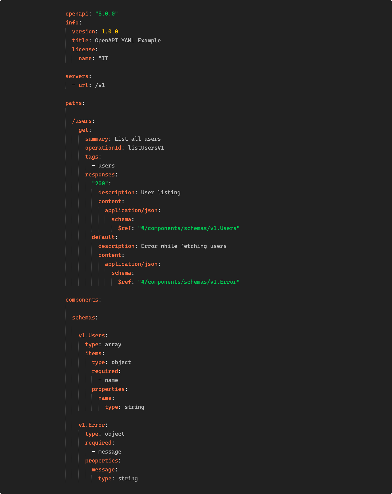

# sublime-beryl

Sublime Text colour scheme based on material colours.

Heavily inspired by Wombat and Flatland.

## Examples

The font used in these screenshots is Cascadia Code.











## Install

### Package Control

Add the package control repository:

https://github.com/akshayganeshen/sublime-packages

Once added, the `Beryl` package will appear in the installable packages.

### Manual

Simply clone the repository into the `Packages/` directory.

For example, on OSX:

```sh
cd "${HOME}/Library/Application Support/Sublime Text 3/Packages"
rm -r ./Beryl/
git clone https://github.com/akshayganeshen/sublime-beryl.git Beryl/
```
